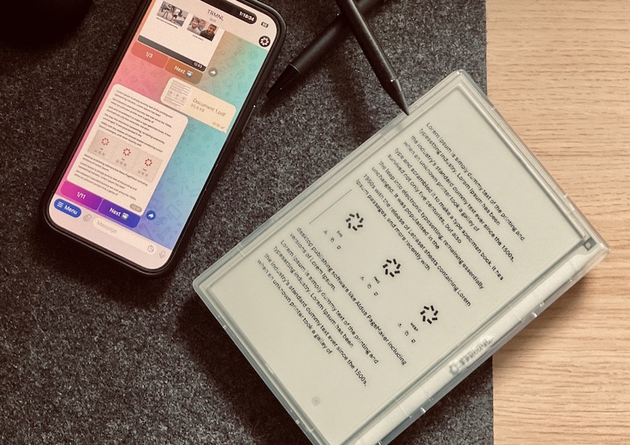

# TEBTRMNL — Telegram eBook Bot for TRMNL

A Telegram bot for reading and navigating PDF and EPUB documents, with integration to the TRMNL platform for custom plugin workflows.



> [!WARNING]  
> This project was created for the [TRMNL Book Reader Hackathon](https://usetrmnl.com/blog/hackathon-book-readers). It is not intended for production use and may contain bugs or incomplete features. Use at your own risk.

> [!NOTE]  
> I believe this project can shine with [the new high refresh rate TRMNL displays](https://x.com/useTRMNL/status/1946001923850547700). If you have one, please try it out and share your feedback!

## Features

- Send a PDF or EPUB to the bot and navigate pages interactively
- EPUB files are automatically converted to PDF with optimized dimensions for TRMNL display
- Each page is converted to an image and can be sent to TRMNL via webhook
- User authorization via Telegram user IDs
- Dockerized deployment with `uv` for fast Python dependency management
- Configurable display dimensions via environment variables
- Navigation buttons for page control


## Project Structure

- `src/main.py` — Bot entrypoint
- `src/pdf_utils.py` — PDF page/image utilities
- `src/epub_utils.py` — EPUB to PDF conversion utilities
- `src/trmnl_utils.py` — TRMNL webhook integration
- `src/markup/` — Liquid templates
- `src/docker-compose.yml` / `Dockerfile` — Containerization

## Quick Start to Host Your Bot

### 1. Create Your TRMNL Plugin

- Go to [TRMNL Private Plugin](https://usetrmnl.com/integrations/private-plugin) and create your plugin.
- Copy your Plugin UUID.

### 2. Create Your Telegram Bot

- Use [BotFather](https://core.telegram.org/bots#6-botfather) to create a bot and get your token.

### 3. Prepare Your `.env` File

Create a `.env` file in the project root:
```
TELEGRAM_BOT_TOKEN=your_telegram_bot_token
TRMNL_PLUGIN_UUID=your_trmnl_plugin_uuid
TRMNL_API_BASE=https://usetrmnl.com/api
TRMNL_WIDTH=480                 # (optional) display width in pixels, default: 480
TRMNL_HEIGHT=800                # (optional) display height in pixels, default: 800
FILTER_USER_IDS=123456,789012   # (optional) comma-separated Telegram user IDs
```

### 4. Build & Run with Docker Compose (Recommended)

```fish
docker compose build
docker compose up -d
docker compose logs -f tebt
```

### 5. Manual Docker Build/Run

```fish
docker build -t trmnl-tebt .
docker run --rm --env-file .env trmnl-tebt
```

## Development

### Install Dependencies (with uv)

```fish
uv pip install --system --no-cache-dir -r <(uv pip compile pyproject.toml)
```

### Run Locally

```fish
uv run src/main.py
```

## License

MIT
